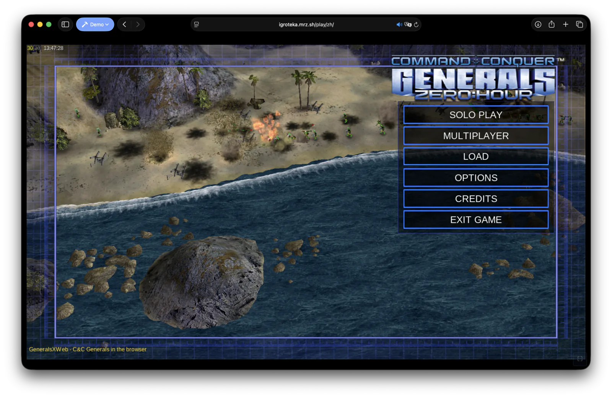
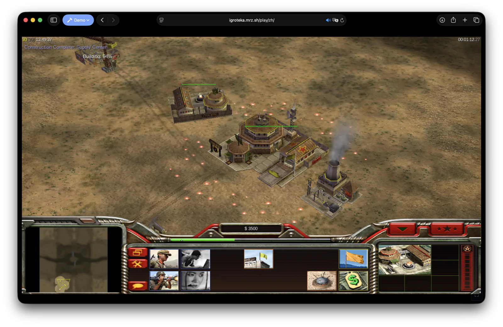
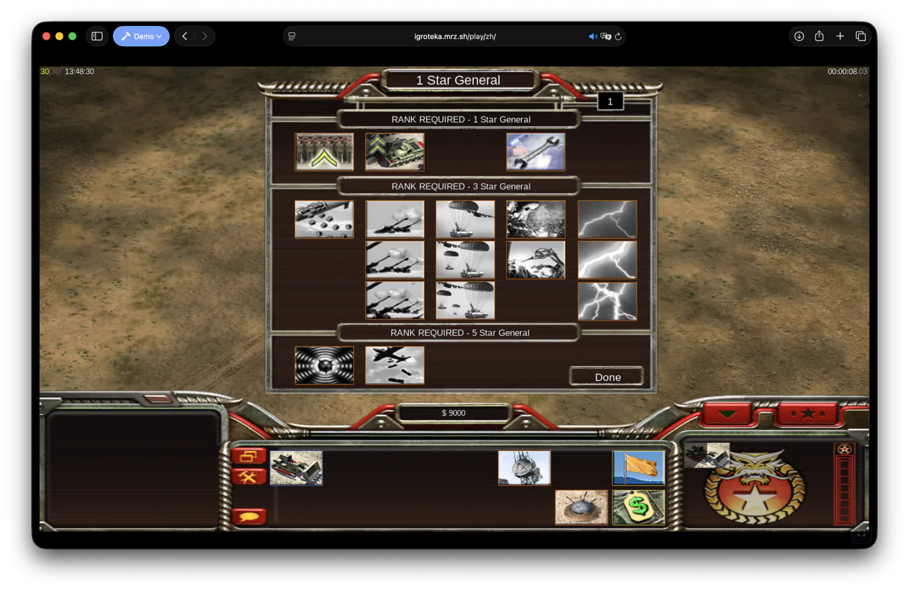

# GeneralsXWeb - Command & Conquer: Generals Zero Hour in the browser

> **⚠️ Experimental.** This port is under active development: expect rendering
> glitches, missing subsystems (audio, multiplayer), broken saves, and
> breaking changes between commits. Not affiliated with or endorsed by EA.

GeneralsXWeb is a **WebAssembly port** of [GeneralsX](https://github.com/fbraz3/GeneralsX),
the cross-platform build of **Command & Conquer: Generals - Zero Hour**. The
engine compiles to wasm with Emscripten and renders through
[Dvijoke d8web](https://github.com/meerzulee/dvijoke), a Direct3D 8 → WebGL2
translation layer. No streaming, no server-side execution - the whole engine
runs in your browser tab.

Play it at **[Igroteka](https://github.com/meerzulee/igroteka)** - the site
stages your own game files (Steam copy required) into browser storage; nothing
is uploaded or hosted.

## Proof of concept

**[▶ 42-second capture](docs/media/gameplay.mp4)** (4.4 MB, H.264): cold boot, `.big`
asset load, main menu, skirmish setup, and a base going up under AI pressure -
one Safari tab, no streaming, no server.

## What works

- Boots to the animated shell map and main menu at 1024×768 (WebGL2)
- Full INI/asset pipeline from the original `.big` archives
- Skirmish AI scripts, menu UI, text rendering, game options
- Tested in Safari and Chrome; Brave needs its fingerprint shield off

## How it is built

- `wasm` CMake preset, Emscripten toolchain (`cmake --preset wasm`, then
  `cmake --build build/wasm --target GeneralsXZH.js`)
- `wasm/` holds the browser glue: boot harness and the d8web bridge shim
- Graphics go through the statically linked d8web backend instead of DirectX

## Lineage and credits

- Electronic Arts - original engine source, released under GPL v3
- [TheSuperHackers/GeneralsGameCode](https://github.com/TheSuperHackers/GeneralsGameCode) - community mainline
- [fbraz3/GeneralsX](https://github.com/fbraz3/GeneralsX) - Linux/macOS cross-platform base this fork tracks
- GeneralsXWeb - the browser/WebAssembly port (this repository)

## License

GPL v3, same as the source it derives from - see [LICENSE.md](LICENSE.md).
Game assets are not included and never will be: you need your own copy of
Zero Hour.
